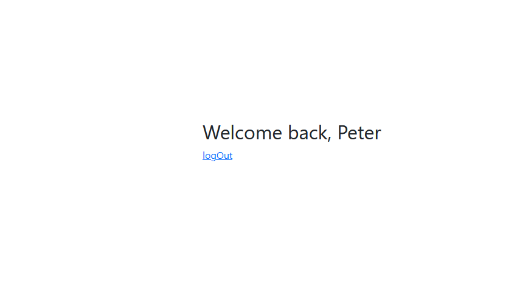

# Handmade Login
  利用expressJS框架簡單完成的登入機制。

* 登入畫面


* 登入成功



* 登入失敗


## 環境建置與需求 (prerequisites)
 * nodeJS: v15.11.0
 * Express: v4.17.1
 * Express-handlebars: v5.3.0

## 安裝與執行步驟 (installation and execution)
  1. 開啟終端機，並輸入以下指令
  ```shell
  git clone https://github.com/stylelinz/handmake-login.git
  ```

  2. 進入專案資料夾，在終端機輸入以下指令
  ```shell
  cd handmake-login

  ```
  3. 安裝npm套件，輸入以下指令

  ```shell
  npm install
  npm i nodemon
  ```

  4. 啟動伺服器，輸入以下指令

  ```shell
  npm run dev
  ```

  5. 當終端機出現以下字樣，表示伺服器已啟動並成功連結，可以在瀏覽器觀看 http://localhost:3000

  ```shell
  Express is listening on http://localhost:3000
  ```

  6. 在終端機按下 `ctrl` + `c` 或 `cmd` + `c`，以關閉伺服器

## 測試用帳號
| Name | Email |Password|
| ------ | ----------- | -----------------|
| Tony  | tony@stark.com | iamironman|
| Steve  | captain@hotmail.com | icandothisallday|
| Peter  | peter@parker.com | enajyram|
| Natasha  | natasha@gamil.com | i*parol#@$!|
| Nick  | nick@shield.com | password|
